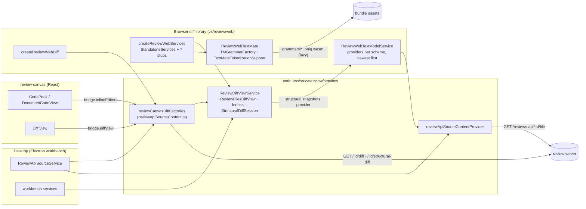
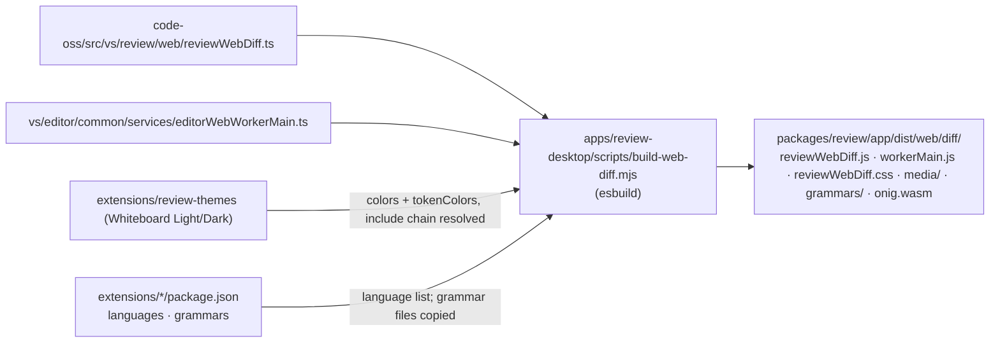
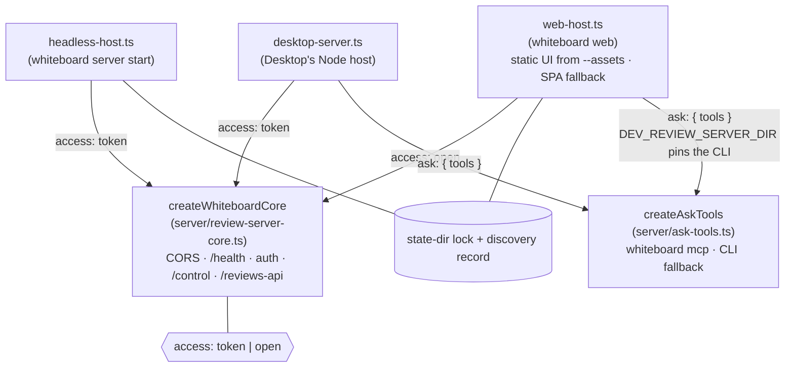
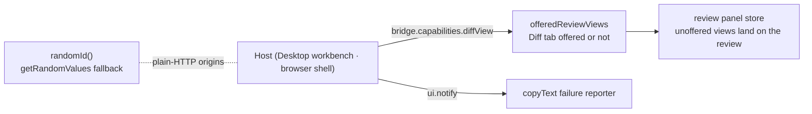
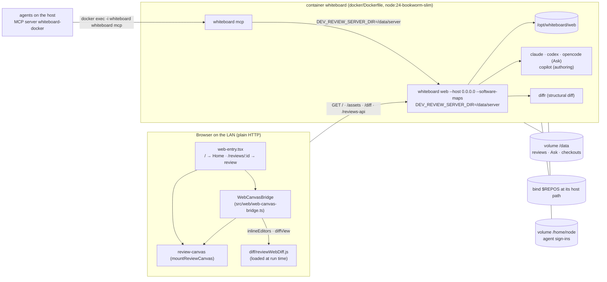

# Architecture

## Review diff rendering: Desktop and browser

Code peeks, the Diff view, lenses and structural diff are one implementation,
`ReviewDiffViewService` in the Code OSS fork. Desktop runs it inside the
workbench; the browser diff library runs the same classes on upstream's
standalone editor services.

## Building the browser diff library

## Review servers

Every host builds the same core. Hosts differ in who may call them and in
what they add around it.

## Canvas host seams

A host mounts the canvas with `mountReviewCanvas(container, content, ui)`.
What it can and cannot provide reaches the canvas through two optional
fields; a host that sets neither, such as Desktop, gets the full canvas.

## The web UI and its container

`whiteboard web` serves one origin: the review API, Ask, and the page built
into `packages/review/app/dist/web`. The Docker image packages all of it.

