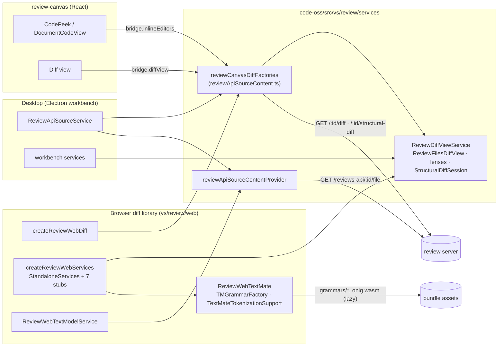
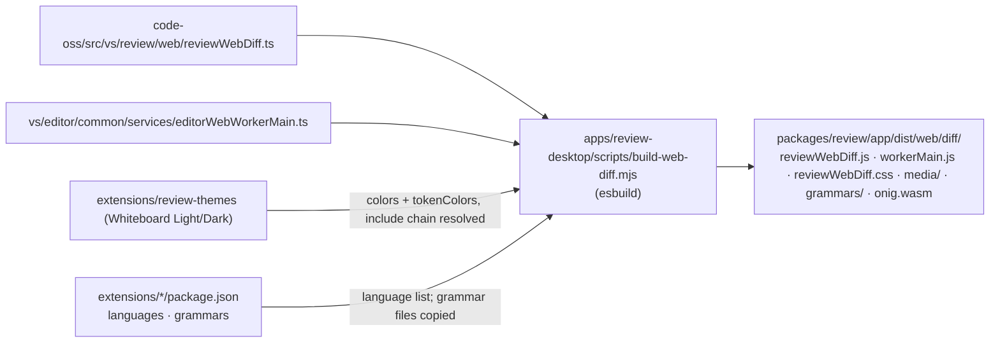
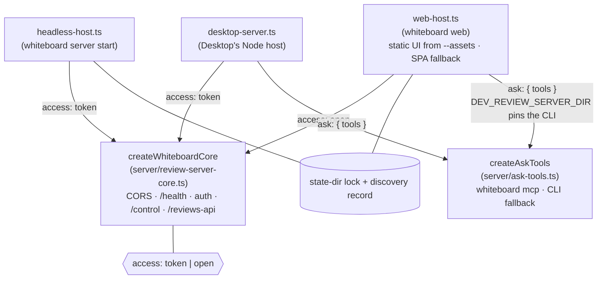

# Architecture

## Review diff rendering: Desktop and browser

Code peeks, the Diff view, lenses and structural diff are one implementation,
`ReviewDiffViewService` in the Code OSS fork. Desktop runs it inside the
workbench; the browser diff library runs the same classes on upstream's
standalone editor services.

## Building the browser diff library

## Review servers

Every host builds the same core. Hosts differ in who may call them and in
what they add around it.

